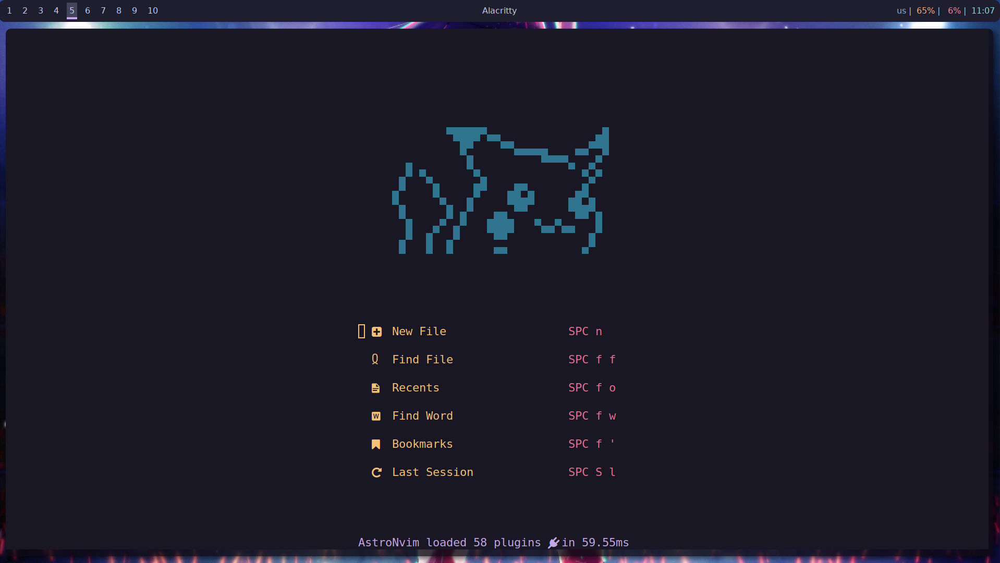
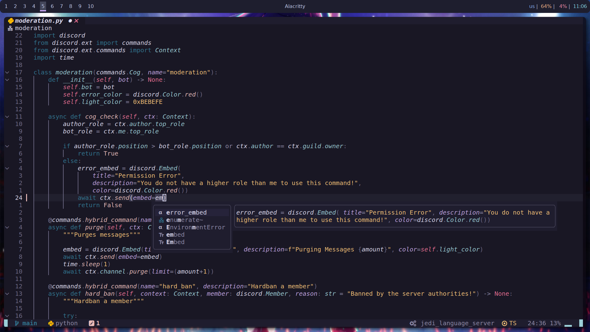
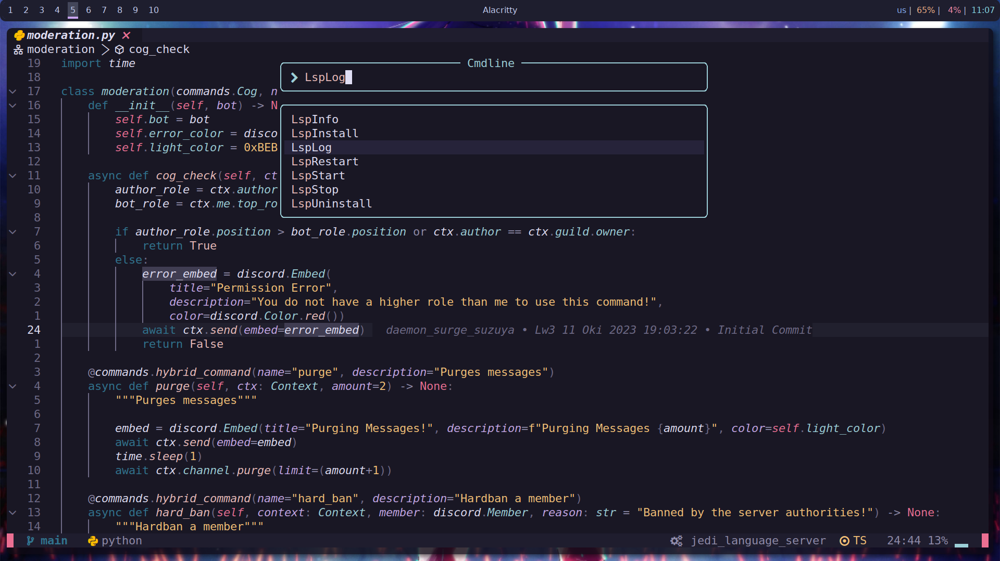
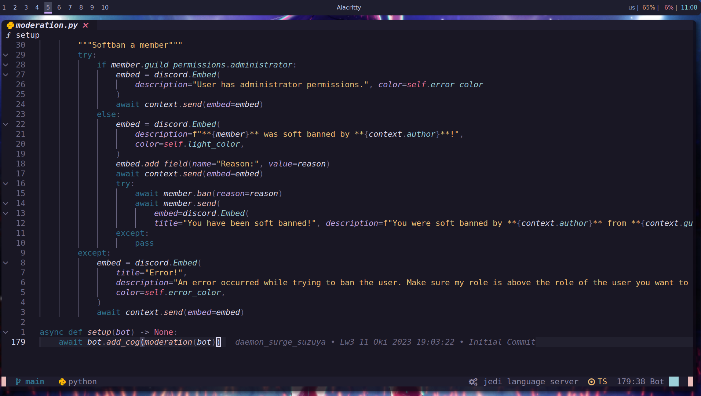

# Neovim
My Neovim configuration is based on [AstroNvim](https://github.com/AstroNvim/AstroNvim).

## Changes I have made:

- I modified the dashboard.
  
  
- I used the rose-pine theme.
  

- I added noice-nvim.
  

- I added git blame.
  

...and more!

## Installation
Ensure that you have a backup. However, if you don't want it and wish to completely wipe out your current Neovim configuration, simply copy and paste the following command into your terminal:

### Linux

```bash
rm -rf ~/.cache/nvim ~/.local/share/nvim ~/.config/nvim && git clone https://github.com/daemon-surge-suzuya/Neovim ~/.config/nvim && nvim
```
### Windows

```
git clone https://github.com/daemon-surge-suzuya/Neovim %userprofile%\AppData\Local\nvim && nvim
```
